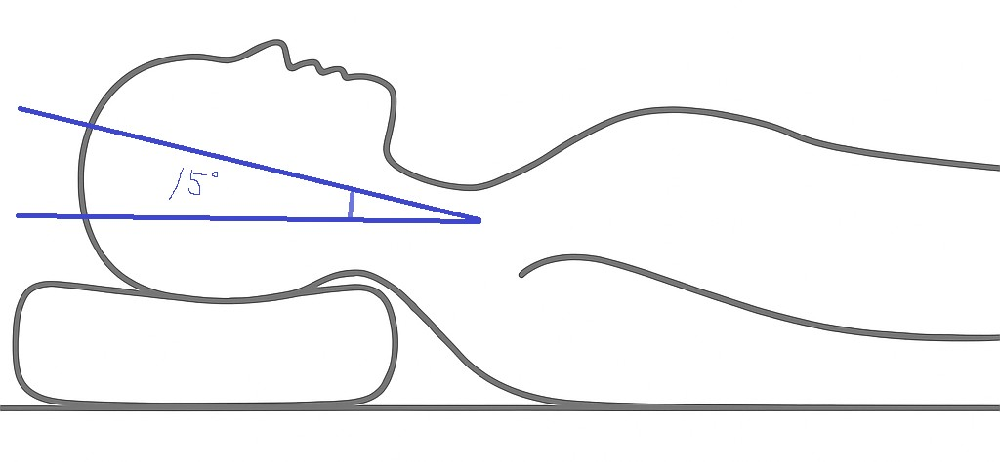

# ai-pillow-head-angle-analyzer

本リポジトリは，AI枕プロジェクトにおいて，カメラ映像を用いて寝ている人の頭部と水平面との角度を推定するシステムです．  
本ツールは今後のAI枕制御のパラメータとして応用することを目的としています．

## 仕様

### 🎯 目的
- 枕に頭部を載せた被験者の姿勢（特に頭部と水平面のなす角度）を画像・映像から推定し，適切な枕の高さ・形状調整に活用する．

### 📷 入力
- カメラで撮影した寝姿画像または動画
- 想定カメラ位置：枕の横方向視点．

### 🧠 出力
- 頭部と水平面のなす角度（度数単位）．
- 姿勢可視化画像（線・角度ラベル付き）．
- イメージ画像（下記のとおり）．

### ⚙️ 処理の流れ（想定している流れ）
1. **画像読み込み**
2. **頭部と水平面のなす角度推定プログラムに入力**
4. **水平線とのなす角度を算出**
5. **出力として角度情報および視覚化画像を生成**

### 🔧 実行環境
- Python 3.11.9
- venvによる仮想環境での実行
